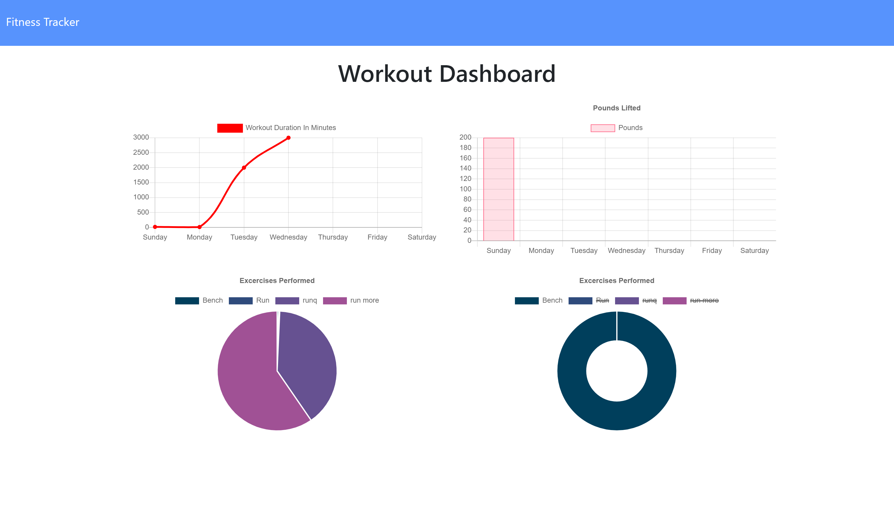

# Fitness-Track

An easy app that allows anyone to access the website and enter there workout. In one day, many people do multiple types of exercises that are both cardio and resistance. So, a user starts a new workout, the app starts a new mongo entry for their workout. It is poplulated then by entering exercises the users wants. For example, cardio, running for 3 miles in 30 mins and bench for 200 lbs for 3 sets of 10 reps and its duration. Once the user is finish, they may track their stats as well to see any improvements or overall duration of workout.

## Main Features

1/ Add a new workout file
2/ Add exercises to the workout
3/ Track stats

## Built With
* Express.js
* Node.js
* MongoDB

## Image

https://fitness-tracker-clos.herokuapp.com/

